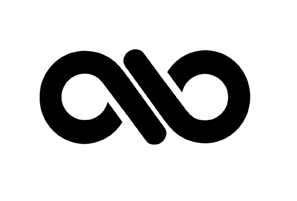
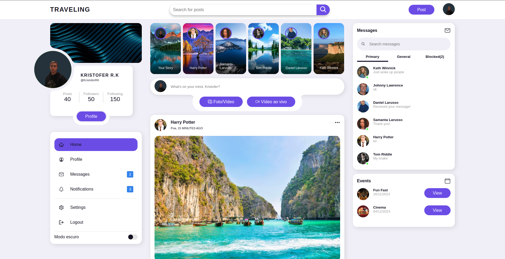
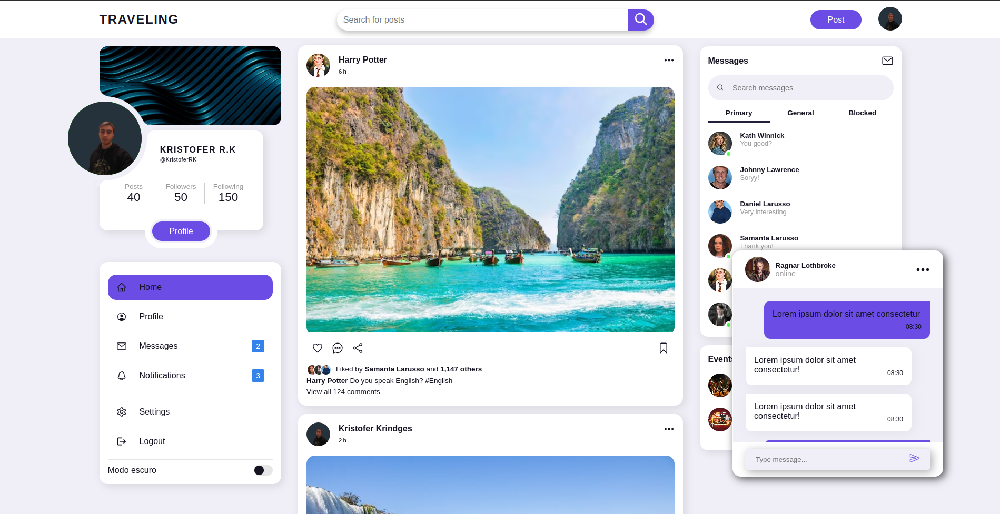
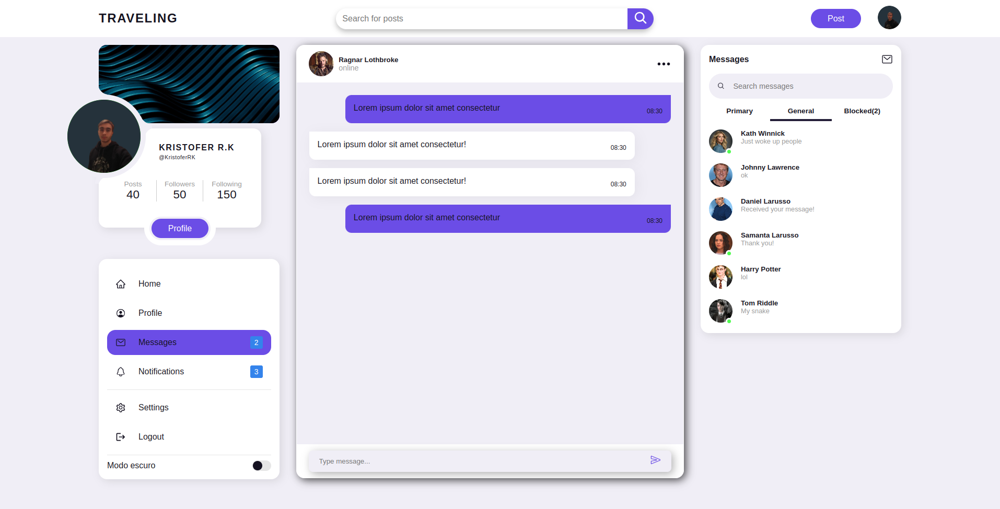
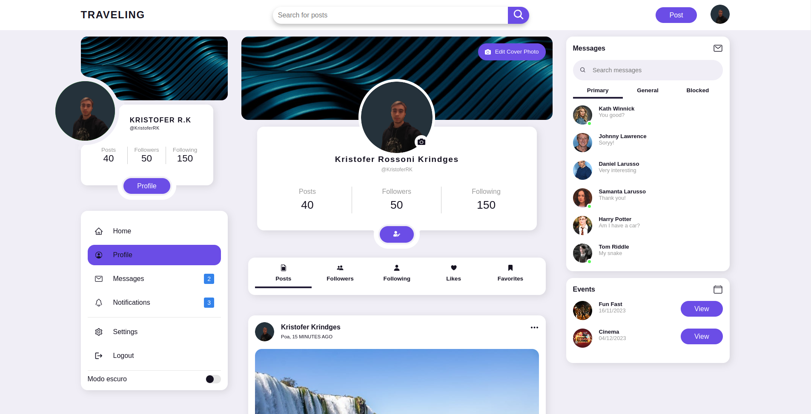
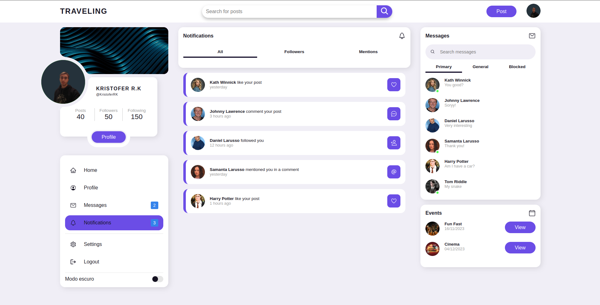
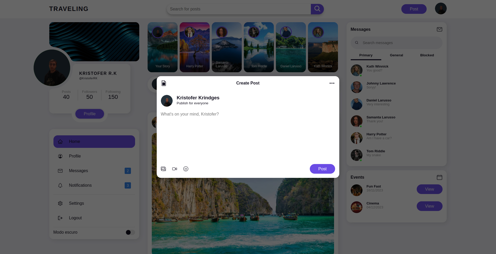

  

<h1 align="center">
  Traveling
</h1>

 <a href="#project">Project</a> •
 <a href="#layout">Layout</a> • 
 <a href="#stack">Stack</a> • 
 <a href="#start">Start</a> •
 <a href="#api">Api</a>

<h2 id="project">Social Media 🤳</h2>
**The Travelling project is a social media.** Which has the ability for the user to create posts, interact with posts through likes and comments, edit their profile along with their photo, receive notifications about their posts and possible followers and interaction via chat in real time.

<h2 id="layout">Application Layout 🖥</h2>
<h3>Home</h3>

  
  

<h3>Home-Chat</h3>

  

<h3>Chat</h3>

  

<h3>Profile</h3>

  

<h3>Notifications</h3>

  

<h3>Post</h3>

  

<h2 id="stack">Stack Technological 👨‍💻</h2>
- React
- Styled Components
- React Icons
- React Router DOM
- React Toastify
- Axios

<h2 id="api">API 👨‍💻</h2>
<a align="center" href="https://github.com/kristoferkrindges/TravelingApi" />
  Acesse clicando aqui
</a>
